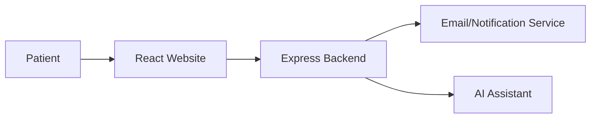

# 🚀 Sarath Reddy Clinic

> A professional medical clinic website featuring AI-assisted booking and modern web design.

### 🌐 Live Demo
[🚀 OPEN LIVE DEMO →](https://sarathreddyclinic.vercel.app) | [💻 Source Code](https://github.com/YUVA-2329/sarathreddyclinic) 

---

## 🎬 Demo & 📸 Screenshots


*(Project preview and screenshots demonstrating the core user experience)*

---

## 🧠 About the Project

This project was built to solve real-world challenges through modern web technologies and advanced engineering. By combining scalable architecture with an intuitive user interface, Sarath Reddy Clinic provides an exceptional user experience while maintaining high performance and security.

### ✨ Key Features
- 🏥 Professional healthcare UI
- 🤖 AI chatbot for patient inquiries
- 📱 Mobile-optimized patient experience
- ⚡ Fast loading times
- 🔐 Secure contact forms

---

## 🛠️ Tech Stack

**Frontend:** React, TypeScript, Tailwind CSS, Framer Motion
**Backend:** Node.js, Express
**AI:** Google GenAI

---

## 🏗️ Architecture



---

## ⚙️ How It Works

1. Patients browse medical services on a highly optimized React frontend.
2. They can interact with the AI assistant for basic inquiries.
3. Appointment requests are securely transmitted to the backend.

---

## 🚀 Getting Started

### Installation

```bash
git clone https://github.com/YUVA-2329/sarathreddyclinic.git
cd sarath-reddy-clinic
npm install
npm run dev
```

### Environment Variables
Create a `.env` file in the root directory:
```env
PORT=5000
GEMINI_API_KEY=YOUR_API_KEY
```

---

## 📁 Project Structure

```text
project/
├── src/
│   ├── components/
│   └── pages/
├── server.ts
└── package.json
```

---

## 🛣️ Roadmap

- [x] Landing Page
- [x] AI Integration
- [ ] Appointment Scheduling System
- [ ] Patient Portal

---

## 📊 Status

🟢 Production Ready

---

## 👨‍💻 Author

**Yuva Kishore Peta**  
GitHub: [YUVA-2329](https://github.com/YUVA-2329)
